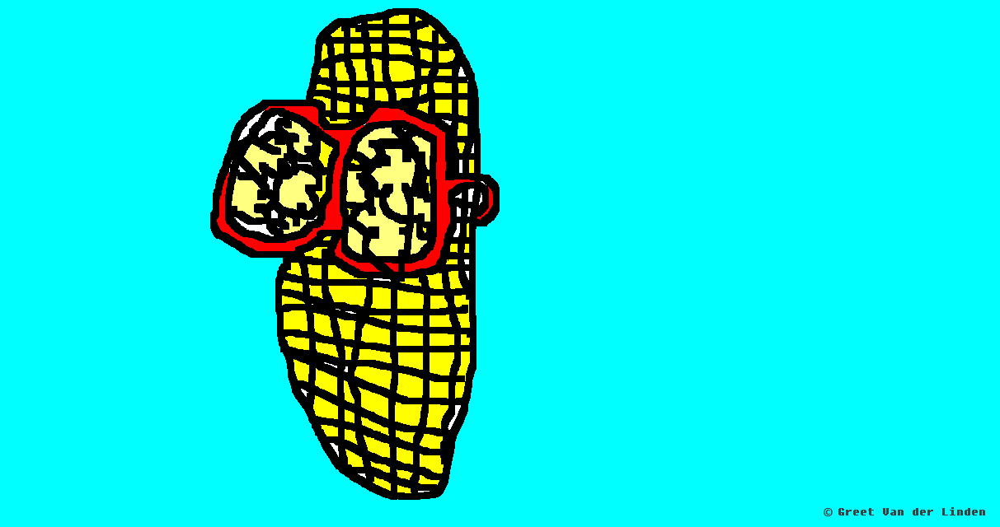
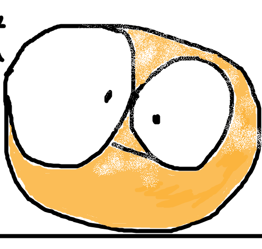

<h3 align="center">Hi! I'm Greet 🖐️</h3>
<!--<h3 align="left">I love everything web development.</h3>-->

- 🌱 I’m currently studying **frontend development**
-  :wrench: And I have a strong interest in the backend too
-  :pencil2: I also like to draw things ---> this is my website:&nbsp;&nbsp; 
-  ✉️  Greet#5582

<!--<h3 align="left">How to reach me</h3>

 Greet#5582
-->
<h3 align="left">Practice ground</h3>

<!--
 Greet#5582
-->
<!--
 @vanderlindengreet
-->
  
  <!--

-->

<h3 align="left">Languages and Tools</h3>

        

<!--
<h3 align="left">Practice ground</h3>

  -->

<!--https://github.githubassets.com/images/modules/open_graph/github-mark.png-->

<!--### Hi there 👋 -->
<!--
**GreetVdL/GreetVdL** is a ✨ _special_ ✨ repository because its `README.md` (this file) appears on your GitHub profile.

Here are some ideas to get you started:

- 🔭 I’m currently working on ...
- 🌱 I’m currently learning ...
- 👯 I’m looking to collaborate on ...
- 🤔 I’m looking for help with ...
- 💬 Ask me about ...
- 📫 How to reach me: ...
- 😄 Pronouns: ...
- ⚡ Fun fact: ...
-->

<!--<h3 align="left">Repositories</h3>-->

<!--
-->

